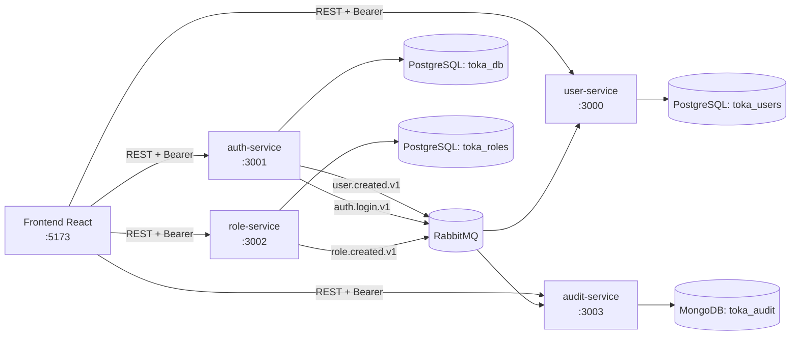

# Toka Technical Test

Arquitectura de microservicios con NestJS + PostgreSQL + MongoDB + RabbitMQ + Redis + frontend React.

## Tabla de contenido

- [Resumen](#resumen)
- [Arquitectura](#arquitectura)
- [Estructura del repositorio](#estructura-del-repositorio)
- [Stack y puertos](#stack-y-puertos)
- [Arranque rápido](#arranque-rápido)
- [Validación end-to-end](#validación-end-to-end)
- [Testing y calidad](#testing-y-calidad)
- [CI](#ci)
- [Documentación detallada](#documentación-detallada)
- [Troubleshooting](#troubleshooting)

## Resumen

Este repositorio incluye:

- 4 microservicios backend:
  - `auth-service` (OAuth2/OIDC + credenciales)
  - `user-service` (gestión de usuarios)
  - `role-service` (gestión de roles)
  - `audit-service` (auditoría en MongoDB)
- Comunicación síncrona por REST y asíncrona por eventos RabbitMQ.
- Autenticación distribuida con tokens `RS256` emitidos por `auth-service`.
- Logging estructurado JSON en todos los servicios.
- Frontend React + Redux con rutas protegidas.
- Docker Compose con infraestructura + microservicios + frontend.

## Arquitectura



## Estructura del repositorio

```text
.
├── docker-compose.yml
├── frontend/
│   ├── src/
│   ├── Dockerfile
│   └── README.md
├── services/
│   ├── auth-service/
│   ├── user-service/
│   ├── role-service/
│   └── audit-service/
├── scripts/
│   └── backend-ci-local.sh
└── docs/
    ├── ARCHITECTURE.md
    ├── API_REFERENCE.md
    ├── RUNBOOK.md
    ├── THUNDER_CLIENT_GUIDE.md
    └── INCIDENT_DIAGNOSIS.md
```

Nota: el frontend activo está en `frontend/`. Existe además `frontend/frontend/` como scaffold legado no usado en la ejecución principal.

## Stack y puertos

| Componente | Puerto host | Descripción |
| --- | ---: | --- |
| `frontend` | `5173` | Cliente React servido por Nginx |
| `auth-service` | `3001` | Auth, OAuth2/OIDC |
| `user-service` | `3000` | CRUD de usuarios |
| `role-service` | `3002` | CRUD de roles |
| `audit-service` | `3003` | Consulta de auditoría |
| `postgres` | `5433` | Bases `toka_db`, `toka_users`, `toka_roles` |
| `mongodb` | `27017` | Base `toka_audit` |
| `rabbitmq` | `5672` | Broker AMQP |
| `rabbitmq-mgmt` | `15672` | UI RabbitMQ |
| `redis` | `6379` | Cache/infraestructura |
| `qdrant` | `6333` | Vector DB (infraestructura) |

## Arranque rápido

### 1) Levantar todo el stack

```bash
docker compose up -d --build --remove-orphans
```

### 2) Verificar contenedores

```bash
docker compose ps
```

### 3) URLs útiles

- Frontend: [http://localhost:5173](http://localhost:5173)
- Auth OIDC metadata: [http://localhost:3001/.well-known/openid-configuration](http://localhost:3001/.well-known/openid-configuration)
- RabbitMQ UI: [http://localhost:15672](http://localhost:15672) (`guest` / `guest`)

## Validación end-to-end

### Flujo mínimo

1. Registrar usuario:

```bash
curl -X POST http://localhost:3001/auth/register \
  -H 'Content-Type: application/json' \
  -d '{"email":"demo@toka.com","password":"secret123"}'
```

2. Login:

```bash
curl -X POST http://localhost:3001/auth/login \
  -H 'Content-Type: application/json' \
  -d '{"email":"demo@toka.com","password":"secret123"}'
```

3. Con `ACCESS_TOKEN`, consumir servicios protegidos:

```bash
curl http://localhost:3000/users -H "Authorization: Bearer $ACCESS_TOKEN"
curl http://localhost:3002/roles -H "Authorization: Bearer $ACCESS_TOKEN"
curl http://localhost:3003/audits -H "Authorization: Bearer $ACCESS_TOKEN"
```

También está documentado paso a paso en Thunder Client en `docs/THUNDER_CLIENT_GUIDE.md`.

## Testing y calidad

### Backend por microservicio

```bash
cd services/auth-service && npm ci && npm run test:cov && npm run build
cd services/user-service && npm ci && npm run test:cov && npm run build
cd services/role-service && npm ci && npm run test:cov && npm run build
cd services/audit-service && npm ci && npm run test:cov && npm run build
```

### Frontend

```bash
cd frontend
npm install
npm run lint
npm run build
npm run test:run
npm run test:coverage
```

<<<<<<< HEAD
### CI local replicando pipeline backend
=======
Cada servicio tiene `coverageThreshold` global mínimo de 70% en `package.json`.

## CI (GitHub Actions)

Workflow: `.github/workflows/backend-ci.yml`

Trigger:

- `push` a `main`/`master`
- `pull_request`

Checks bloqueantes por microservicio (`auth`, `user`, `role`, `audit`):

- `npm ci`
- `npm run test:cov`
- `npm run build`

Artifacts:

- reporte de `coverage/` por cada microservicio.

## Cómo correrlo local

Script local que replica CI:
>>>>>>> d00b207d8d0cca70087426635e29c2199983ff01

```bash
./scripts/backend-ci-local.sh
```

Opciones:

```bash
ONLY_SERVICE=auth-service SKIP_INSTALL=1 ./scripts/backend-ci-local.sh
RUN_LINT=1 SKIP_INSTALL=1 ./scripts/backend-ci-local.sh
```

## CI

Workflow: `/Users/alan/toka-technical-test/.github/workflows/backend-ci.yml`

Qué ejecuta por microservicio (`auth`, `user`, `role`, `audit`):

- `npm ci`
- `npm run test:cov`
- `npm run build`
- subida de artifact de cobertura

## Documentación detallada

- Arquitectura: `docs/ARCHITECTURE.md`
- APIs y contratos: `docs/API_REFERENCE.md`
- Runbook operativo: `docs/RUNBOOK.md`
- Guía Thunder Client: `docs/THUNDER_CLIENT_GUIDE.md`
- Diagnóstico de incidente: `docs/INCIDENT_DIAGNOSIS.md`
- Frontend: `frontend/README.md`

## Troubleshooting

### Error de nombre de contenedor en Mongo

Si aparece conflicto por `toka_mongo`:

```bash
docker rm -f toka_mongo
docker compose up -d --build --remove-orphans
```

### Orphans en Compose

```bash
docker compose up -d --remove-orphans
```

### `401 Unauthorized` en endpoints protegidos

- Verifica que el token provenga de `auth-service`.
- Verifica `OIDC_ISSUER` y `OIDC_AUDIENCE` en servicios consumidores.
- Verifica header: `Authorization: Bearer <token>`.

### Revisar logs de un servicio

```bash
docker compose logs -f auth-service
docker compose logs -f user-service
docker compose logs -f role-service
docker compose logs -f audit-service
```
