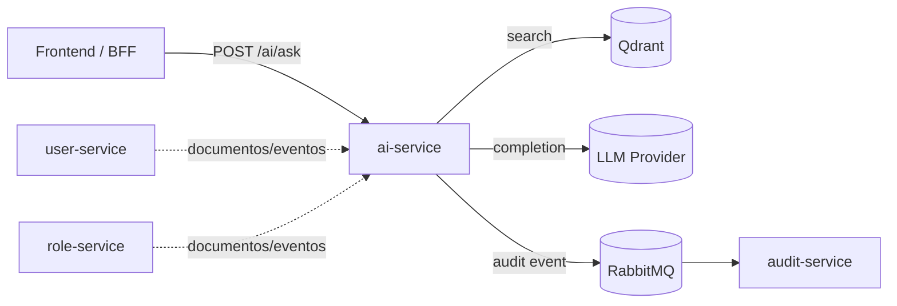

# IA / RAG

## 1. Objetivo

Definir la implementación de un microservicio de IA (`ai-service`) con enfoque RAG para responder preguntas usando contexto interno del sistema de gestión de usuarios/roles/auditoría.

## 2. Estado de implementación

Implementado actualmente:

- Estructura base de `ai-service` en `/Users/alan/toka-technical-test/services/ai-service`.
- Infraestructura de vector DB disponible (`qdrant` en Docker Compose, puerto `6333`).

Pendiente de implementación funcional:

- API del `ai-service`.
- Pipeline de embeddings e indexación.
- Flujo de consulta RAG (retrieve + generate).
- Métricas automáticas de latencia/costo/rate limiting.

## 3. Arquitectura objetivo



## 4. Pipeline RAG (propuesto)

### 4.1 Ingestión

1. Recibir documento (`POST /ai/ingest`) o evento de dominio.
2. Normalizar texto y metadatos.
3. Dividir en chunks (ej. 500-800 tokens).
4. Generar embeddings por chunk.
5. Persistir en Qdrant con payload:
   - `documentId`
   - `chunkId`
   - `source`
   - `tags`
   - `timestamp`

### 4.2 Consulta

1. Recibir pregunta (`POST /ai/ask`).
2. Generar embedding de la pregunta.
3. Recuperar `topK` chunks de Qdrant.
4. Construir prompt con contexto recuperado.
5. Ejecutar generación en LLM.
6. Responder con:
   - `answer`
   - `sources`
   - `latencyMs`
   - `tokenUsage`

## 5. Prompt engineering (estrategia)

Sistema:

- Rol: asistente técnico del sistema.
- Restricción: responder solo con evidencia de contexto recuperado.
- Regla: si no hay evidencia suficiente, responder "No hay información suficiente en el contexto".

Plantilla recomendada:

```text
You are a backend technical assistant.
Answer using only the provided context.
If context is insufficient, say so explicitly.

Question:
{{question}}

Context:
{{retrieved_chunks}}
```

## 6. Contratos API sugeridos

### `POST /ai/ingest`

Request:

```json
{
  "documentId": "user-policy-001",
  "content": "...",
  "source": "policy",
  "tags": ["users", "security"]
}
```

Response:

```json
{
  "documentId": "user-policy-001",
  "chunks": 12,
  "embeddingModel": "text-embedding-3-small"
}
```

### `POST /ai/ask`

Request:

```json
{
  "question": "¿Qué scopes necesita role-service?",
  "topK": 5,
  "filters": {
    "source": "api_reference"
  }
}
```

Response:

```json
{
  "answer": "...",
  "sources": [
    {
      "documentId": "api-reference-v1",
      "chunkId": "api-reference-v1#12"
    }
  ],
  "latencyMs": 420,
  "tokenUsage": {
    "input": 900,
    "output": 220
  }
}
```

## 7. Métricas mínimas de evaluación

- Latencia:
  - `p50_latency_ms`
  - `p95_latency_ms`
  - `p99_latency_ms`
- Costo estimado:
  - `estimated_cost_usd` por request
  - `total_cost_usd` por ventana de tiempo
- Calidad operativa:
  - `% respuestas con fuente`
  - `% respuestas "insufficient context"`

## 8. Rate limiting

Política recomendada:

- límite por IP o API key.
- retorno `429 Too Many Requests` al exceder.
- cabeceras recomendadas:
  - `X-RateLimit-Limit`
  - `X-RateLimit-Remaining`
  - `Retry-After`

## 9. Logging JSON para IA

Campos mínimos sugeridos por request:

- `timestamp`
- `service: "ai-service"`
- `requestId`
- `path`
- `latencyMs`
- `model`
- `embeddingModel`
- `inputTokens`
- `outputTokens`
- `estimatedCostUsd`
- `statusCode`

## 10. Checklist de cierre para entrevista

- Endpoint `POST /ai/ingest` funcional.
- Endpoint `POST /ai/ask` funcional.
- Inserción/consulta real en Qdrant.
- Evidencia de latencia/costo/rate-limiting.
- Integración con al menos un microservicio existente.
