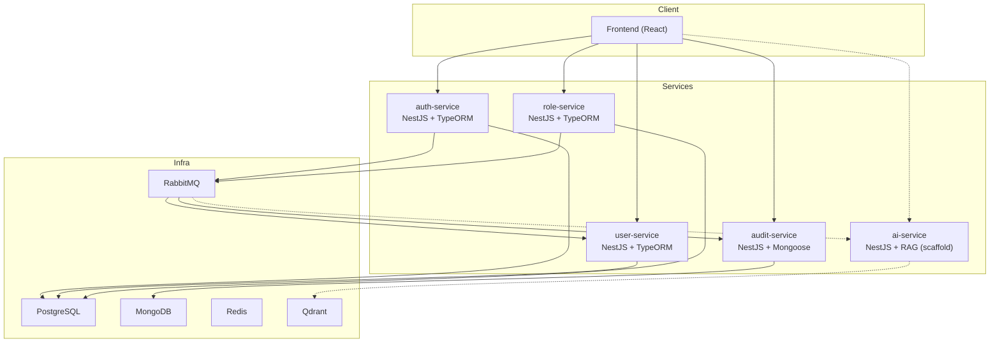

# Arquitectura

## 1. Visión general

El sistema está compuesto por 4 microservicios backend operativos, 1 frontend y 1 servicio de IA en scaffold:

- `auth-service`: autenticación, emisión de tokens OAuth2/OIDC, publicación de eventos de auth.
- `user-service`: CRUD de usuarios y consumo de eventos de alta de usuario.
- `role-service`: CRUD de roles y publicación de eventos de dominio.
- `audit-service`: persistencia de auditoría en MongoDB y consumo de eventos.
- `ai-service`: microservicio RAG (estructura creada, implementación funcional pendiente).
- `frontend`: cliente React + Redux con rutas protegidas.

## 2. Topología técnica

## 3. Persistencia y ownership de datos

- PostgreSQL:
  - `toka_db` -> `auth-service`
  - `toka_users` -> `user-service`
  - `toka_roles` -> `role-service`
- MongoDB:
  - `toka_audit` -> `audit-service`
- Qdrant:
  - `toka_knowledge` -> `ai-service` (objetivo de diseño)
- Redis está definido como infraestructura del entorno.

## 4. Comunicación síncrona (REST)

- `auth-service`: `POST /auth/register`, `POST /auth/login`, `POST /oauth/token`, `GET /auth/profile`, endpoints OIDC.
- `user-service`: CRUD en `/users` (protegido con JWT).
- `role-service`: CRUD en `/roles` (protegido con JWT).
- `audit-service`: `GET /audits` (protegido con JWT).

## 5. Comunicación asíncrona (eventos)

- Eventos publicados:
  - `user.created.v1`
  - `role.created.v1`
  - `auth.login.v1`
- Compatibilidad legacy:
  - `user.created`
- Colas RabbitMQ:
  - `user_events`
  - `audit_events`

## 6. Autenticación distribuida (OAuth2/OIDC)

- Issuer central: `auth-service`.
- Emisión de access token `RS256`.
- Endpoints OIDC:
  - `GET /.well-known/openid-configuration`
  - `GET /.well-known/jwks.json`
- Servicios consumidores (`user`, `role`, `audit`) validan:
  - `issuer` (`OIDC_ISSUER`)
  - `audience` (`OIDC_AUDIENCE`)
  - `RS256` con llave pública OIDC.

## 7. Logging estructurado JSON

Cada microservicio define:

- `src/shared/logging/json-logger.service.ts`
- `src/shared/logging/request-logger.middleware.ts`

Campos principales:

- `timestamp`
- `level`
- `service`
- `message`
- `context`/`trace` (según corresponda)
- `method`, `path`, `statusCode`, `durationMs` para request logs

## 8. Evidencia de DDD / Clean Architecture / SOLID

### `role-service`

- Dominio: `services/role-service/src/domain/role/`
- Aplicación (casos de uso): `services/role-service/src/application/roles/use-cases/`
- Infraestructura:
  - persistencia: `services/role-service/src/infrastructure/persistence/typeorm/`
  - mensajería: `services/role-service/src/infrastructure/messaging/`
  - auth: `services/role-service/src/infrastructure/auth/`
- Interfaces de entrada HTTP: `services/role-service/src/interfaces/http/`

### `audit-service`

- Dominio: `services/audit-service/src/domain/audit/`
- Aplicación (casos de uso): `services/audit-service/src/application/audit/use-cases/`
- Infraestructura:
  - persistencia Mongo: `services/audit-service/src/infrastructure/persistence/mongo/`
  - mensajería: `services/audit-service/src/infrastructure/messaging/`
  - auth: `services/audit-service/src/infrastructure/auth/`
- Interfaces HTTP: `services/audit-service/src/interfaces/http/`

### `auth-service` y `user-service`

- Arquitectura modular por bounded context (`auth`, `users`, `config`, `shared`).
- Validación de configuración, guards de seguridad, DTOs tipados y ownership explícito de datos.

## 9. Resiliencia básica implementada

- Publicación de eventos con `timeout` + `catchError` (no rompe request principal si falla mensajería).
- Validación estricta de variables de entorno al arranque.
- Migraciones habilitadas por `DB_MIGRATIONS_RUN=true` y `synchronize=false` en servicios TypeORM.
